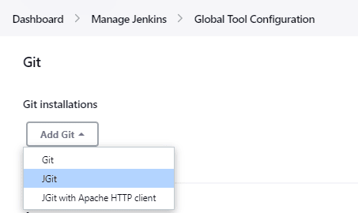
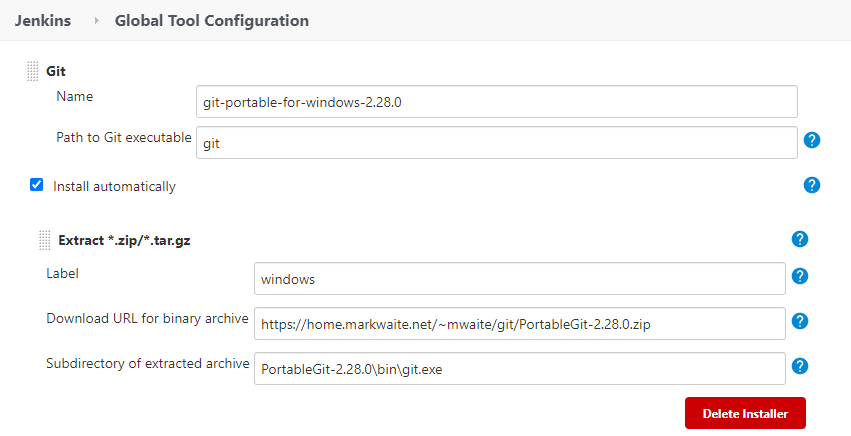

[#git-client-plugin]
= Git Client Plugin
:toc: macro
:toc-title:

[#introduction]
== Introduction

[.float-group]
--
[.text-center]
image:https://jenkins.io/images/logos/jenkins/jenkins.png[Jenkins logo,height=192,role=center,float=right]

image:https://git-scm.com/images/logos/downloads/Git-Logo-2Color.png[Git logo,height=128,float=right]
--

The git client plugin provides git application programming interfaces (APIs) for Jenkins plugins.
It can fetch, checkout, branch, list, merge, and tag repositories.
Refer to the https://javadoc.jenkins-ci.org/plugin/git-client/[API documentation] for specific API details.

The https://javadoc.jenkins-ci.org/plugin/git-client/org/jenkinsci/plugins/gitclient/GitClient.html[GitClient interface] provides the primary entry points for git access.
It supports username / password credentials for git repository access with HTTP and HTTPS protocols (for example, `+https://github.com/jenkinsci/git-client-plugin+` or `+http://git.example.com/your-repo.git+` ).
It supports private key credentials for git repository access with SSH protocol (for example, `+git@github.com:jenkinsci/git-client-plugin.git+` or `+ssh://git@github.com/jenkinsci/git-client-plugin.git+` ).
Credential support is provided by the https://plugins.jenkins.io/credentials[Jenkins credentials plugin].

toc::[]

[#changelog]
== Changelog in https://github.com/jenkinsci/git-client-plugin/releases[GitHub Releases]

Release notes have been recorded in https://github.com/jenkinsci/git-client-plugin/releases[GitHub] since git client plugin 2.8.1.
Prior release notes are recorded in the git client plugin repository link:CHANGELOG.adoc#changelog-moved-to-github-releases[change log].

[#implementations]
== Implementations

The git client plugin default implementation requires that https://git-scm.com/downloads[command line git] is installed on the controller and on every agent that will use git.
Command line git implementations working with large files should also install https://git-lfs.github.com/[git LFS].
The command line git implementation is the canonical implementation of the git interfaces provided by the git client plugin.

Command line git is *enabled by default* when the git client plugin is installed.

[#jgit]
=== JGit

The git client plugin also includes two optional implementations ("jgit" and <<jgit-with-apache-http-client,"jgitapache">>) that use https://www.eclipse.org/jgit/[Eclipse JGit], a pure Java implementation of git.
The JGit implementation in the git client plugin provides most of the functionality of the command line git implementation.
When the JGit implementation is incomplete, the gap is noted in console logs.

JGit is *disabled by default* when the git client plugin is installed.

[#enabling-jgit]
=== Enabling JGit

Click the "*Add Git*" button in the "*Global Tool Configuration*" section under "*Manage Jenkins*" to add JGit or JGit with Apache HTTP Client as a git implementation.

[#jgit-with-apache-http-client]
=== JGit with Apache HTTP Client

The original JGit implementation inside the git client plugin had issues with active directory authentication.
A workaround was implemented to provide JGit but use Apache HTTP client for authentication.
The issue in JGit has now been resolved and delivered in git client plugin releases.
JGit with Apache HTTP Client continues to delivered to assure compatibility.

[#installing-portablegit-automatically]
=== Installing PortableGit Automatically

The git client plugin can install link:https://git-scm.com/download/win[Git for Windows Portable] automatically from a zip file.

* Download and install link:https://github.com/git-for-windows/git/releases/[Git for Windows Portable] from its 7z.exe file.
* Create a zip file of the installation as `PortableGit-a.bb.c.zip`.
* Upload that zip file to an HTTP server.
* Set the `Download URL for binary archive` as the URL of the uploaded zip file.
* Leave `Path to Git` executable as `git`.
* Specify `PortableGit-a.bb.c\bin\git.exe` for the `Subdirectory of extracted archive`.
  This points to the git.exe in the archive relative to the root of the archive.

Git for Windows Portable will be installed on each agent in `tools\git\PortableGit-a.bb.c`.
The path to the git executable will be `tools\git\PortableGit-a.bb.c\bin\git.exe`.

[#windows-credentials-manager]
== Windows Credentials Manager

Git for Windows is able to integrate with the Windows Credentials Manager for secure storage of credentials.
Windows Credentials Manager works very well for interactive users on the Windows desktop.
Windows Credentials Manager does not work as well for batch processing in the git client plugin.
It is best to disable Windows Credentials Manager when installing Git on Jenkins agents running Windows.

[#bug-reports]
== Bug Reports

Report issues and enhancements with the https://issues.jenkins-ci.org[Jenkins issue tracker].
Please use the link:https://www.jenkins.io/participate/report-issue/["How to Report an Issue"] guidelines when reporting issues.

[#contributing-to-the-plugin]
== Contributing to the Plugin

Refer to link:CONTRIBUTING.adoc#contributing-to-the-git-client-plugin[contributing to the plugin] for contribution guidelines.

==  Plugin Properties

Some plugin settings are controlled by Java system properties.
The properties are often used to override a standard behavior or to revert to previous behavior.
Refer to link:https://www.jenkins.io/doc/book/managing/system-properties/[Jenkins Features Controlled with System Properties] for more details on system properties and how to set them.

checkRemoteURL::
When `org.jenkinsci.plugins.gitclient.CliGitAPIImpl.checkRemoteURL` is set to `false` it disables the safety checking of repository URLs.
+
Default is `true` so that repository URL's are rejected if they start with `-` or contain space characters.

forceFetch::
When `org.jenkinsci.plugins.gitclient.CliGitAPIImpl.forceFetch` is set to `false` it allows command line git versions 2.20 and later to not update tags which have already been fetched into the workspace.
+
Command line git 2.20 and later have changed behavior when fetching remote tags that already exist in the repository.
Command line git before 2.20 silently updates an existing tag if the remote tag points to a different SHA1 than the local tag.
Command line git 2.20 and later do not update an existing tag if the remote tag points to a different SHA1 than the local tag unless the `--force` option is passed to `git fetch`.
+
Default is `true` so that newer command line git versions behave the same as older versions.

promptForAuthentication::
When `org.jenkinsci.plugins.gitclient.CliGitAPIImpl.promptForAuthentication` is set to `true` it allows command line git versions 2.3 and later to prompt the user for authentication.
Command line git prompting for authentication should be rare, since Jenkins credentials should be managed through the credentials plugin.
+
Credential prompting could happen on multiple platforms, but is more common on Windows computers because many Windows agents run from the desktop environment.
Agents running on the desktop are much less common in Unix environments.
+
Default is `false` so that command line git does not prompt for interactive authentication.

useCLI::
When `org.jenkinsci.plugins.gitclient.CliGitAPIImpl.useCLI` is set to `false`, it will use JGit as the default implementation instead of command line git.
+
Default is `true` so that command line git is chosen as the default implementation.

user.name.file.encoding::
When `org.jenkinsci.plugins.gitclient.CliGitAPIImpl.user.name.file.encoding` is set to a non-empty value (like `IBM-1047`) and the agent is running on IBM zOS, the username credentials file is written using that character set.
The character sets of other credential files are not changed.
The character sets on other operating systems are not changed.
+
Default is empty so that zOS file encoding behaves as it did previously.

user.passphrase.file.encoding::
When `org.jenkinsci.plugins.gitclient.CliGitAPIImpl.user.passphrase.file.encoding` is set to a non-empty value (like `IBM-1047`) and the agent is running on IBM zOS, the ssh passphrase file is written using that character set.
The character sets of other credential files are not changed.
The character sets on other operating systems are not changed.
+
Default is empty so that zOS file encoding behaves as it did previously.

user.password.file.encoding::
When `org.jenkinsci.plugins.gitclient.CliGitAPIImpl.user.password.file.encoding` is set to a non-empty value (like `IBM-1047`) and the agent is running on IBM zOS, the password file is written using that character set.
The character sets of other credential files are not changed.
The character sets on other operating systems are not changed.
+
Default is empty so that zOS file encoding behaves as it did previously.

useSETSID::
When `org.jenkinsci.plugins.gitclient.CliGitAPIImpl.useSETSID` is set to `true` and the `setsid` command is available, the git client process on non-Windows computers will be started with the `setsid` command so that they are detached from any controlling terminal.
Most agents are run without a controlling terminal and the `useSETSID` setting is not needed.
Enable `useSETSID` only in those rare cases where the agent is running with a controlling terminal.
If it is not used in those cases, the agent may block on some authenticated git operations.
+
This setting can be helpful with link:https://plugins.jenkins.io/swarm/[Jenkins swarm agents] and inbound agents started from a terminal emulator.
+
Default is `false` so that `setsid` is not used.
