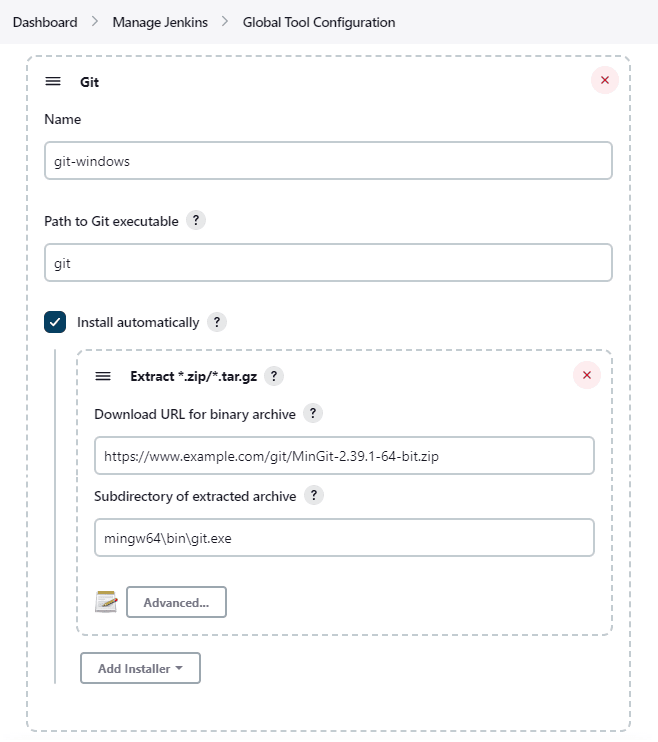
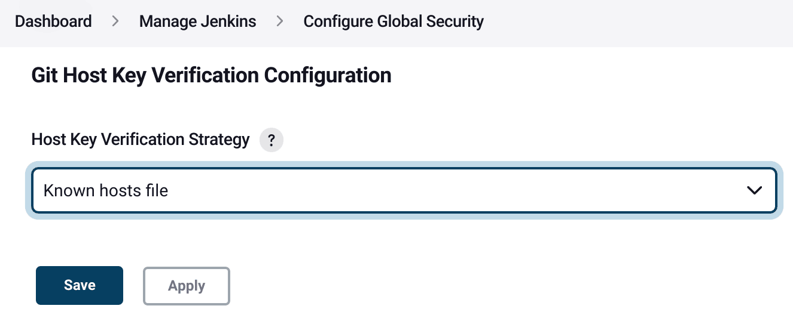

[#git-client-plugin]
= Git Client Plugin
:toc: macro
:toc-title:

[#introduction]
== Introduction

[.float-group]
--
[.text-center]
image:https://jenkins.io/images/logos/jenkins/jenkins.png[Jenkins logo,height=192,role=center,float=right]
image:images/signe-1923369_640.png[plus,height=64,float=right]
image:https://git-scm.com/images/logos/downloads/Git-Logo-2Color.png[Git logo,height=128,float=right]
--

The git client plugin provides git application programming interfaces (APIs) for Jenkins plugins.
It can fetch, checkout, branch, list, merge, and tag repositories.
Refer to the https://javadoc.jenkins-ci.org/plugin/git-client/[API documentation] for specific API details.

The https://javadoc.jenkins-ci.org/plugin/git-client/org/jenkinsci/plugins/gitclient/GitClient.html[GitClient interface] provides the primary entry points for git access.
It supports username / password credentials for git repository access with HTTP and HTTPS protocols (for example, `+https://github.com/jenkinsci/git-client-plugin+` or `+https://git.example.com/your-repo.git+` ).
It supports private key credentials for git repository access with SSH protocol (for example, `+git@github.com:jenkinsci/git-client-plugin.git+` or `+ssh://git@github.com/jenkinsci/git-client-plugin.git+` ).
Credential support is provided by the https://plugins.jenkins.io/credentials[Jenkins credentials plugin].

toc::[]

[#changelog]
== Changelog in https://github.com/jenkinsci/git-client-plugin/releases[GitHub Releases]

Release notes have been recorded in https://github.com/jenkinsci/git-client-plugin/releases[GitHub] since git client plugin 2.8.1.
Prior release notes were recorded in the git client plugin repository link:https://github.com/jenkinsci/git-client-plugin/blob/91c7435dffb489c1e0eb0252c7992c61054b822e/CHANGELOG.adoc#changelog-moved-to-github-releases[change log].

[#implementations]
== Implementations

The git client plugin default implementation requires that https://git-scm.com/downloads[command line git] is installed on the controller and on every agent that will use git.
Command line git implementations working with large files should also install https://git-lfs.github.com/[git LFS].
The command line git implementation is the canonical implementation of the git interfaces provided by the git client plugin.

Command line git is *enabled by default* when the git client plugin is installed.

[#jgit]
=== JGit

The git client plugin also includes two optional implementations ("jgit" and <<jgit-with-apache-http-client,"jgitapache">>) that use https://www.eclipse.org/jgit/[Eclipse JGit], a pure Java implementation of git.
The JGit implementation in the git client plugin provides most of the functionality of the command line git implementation.
When the JGit implementation is incomplete, the gap is noted in console logs.

JGit is *disabled by default* when the git client plugin is installed.

[#enabling-jgit]
=== Enabling JGit

Click the "*Add Git*" button in the "*Global Tool Configuration*" section under "*Manage Jenkins*" to add JGit or JGit with Apache HTTP Client as a git implementation.

image::images/enable-jgit.png[Enable JGit or JGit with Apache HTTP Client]

=== JGit timeout

The command line git implementation in the git client plugin provides a timeout setting for many operations like fetch and checkout.
Operations that take more than the specified time are canceled.
When the timeout is exceeded, the command line git process fails and the git client plugin API operation fails.

The JGit implementation in the git client plugin uses a different concept of timeout.
The JGit timeout is a network level transport timeout rather than a timeout of a higher level JGit operation.
If the JGit network transport does not receive a response within the defined timeout, the JGit API call fails.
The link:https://javadoc.io/doc/org.eclipse.jgit/org.eclipse.jgit/latest/org.eclipse.jgit/org/eclipse/jgit/transport/Transport.html#setTimeout(int)[JGit javadoc] describes the JGit API.

The JGit timeout implementation prevents JGit operations from hanging indefinitely when a remote server stops responding.
It does not stop a JGit operation if it has executed for more than a specified time.
The JGit timeout counter is reset each time a response is received from the remote server during the JGit API call.
The command line git timeout counter is set at the start of the command line git call and is not reset during the call.

[#jgit-with-apache-http-client]
=== JGit with Apache HTTP Client

The original JGit implementation inside the git client plugin had issues with active directory authentication.
A workaround was implemented to provide JGit but use Apache HTTP client for authentication.
The issue in JGit has now been resolved and delivered in git client plugin releases.
JGit with Apache HTTP Client continues to delivered to assure compatibility.

[#installing-mingit-for-windows-automatically]
=== Installing MinGit for Windows Automatically

Jenkins can install link:https://github.com/git-for-windows/git/wiki/MinGit[MinGit for Windows] automatically.
MinGit for Windows is an intentionally minimal, non-interactive distribution of Git for Windows, with third-party applications as its intended audience.
Jenkins is well suited to use MinGit on Windows agents.

* Configure a global git tool from "Manage Jenkins" >> "Global Tool Configuration" with `git` as the `Path to Git executable`
* Set the label `windows` to limit the tool installer to agents with the `windows` label
* Set the `Download URL for binary archive` as the URL of your locally downloaded copy of the link:https://github.com/git-for-windows/git/releases/[MinGit zip file]
* Specify `mingw64\bin\git.exe` as the `Subdirectory of extracted archive`.

Git for Windows Portable will be installed on each agent in `tools\git\mingw64`.
The path to the git executable will be `tools\git\mingw64\bin\git.exe`.

[#windows-credentials-manager]
== Windows Credentials Manager

Git for Windows is able to integrate with the Windows Credentials Manager for secure storage of credentials.
Windows Credentials Manager works very well for interactive users on the Windows desktop.
Windows Credentials Manager does not work as well for batch processing in the git client plugin.
It is best to disable Windows Credentials Manager when installing Git on Jenkins agents running Windows.

[#ssh-host-key-verification]
== SSH Host Key verification

Git Client plugin provides various options to verify the SSH keys presented by Git repository host servers.
By default, Git Client plugin uses the "Known hosts file" strategy to verify all host keys using the known_hosts file.

Host key verification strategies include:

Accept first connection::
Remembers the first host key encountered for each git server and requires that the same host key must be use for later access.
This is usually the most convenient setting for administrators while still providing ssh host key verification

Known hosts file::
Uses the existing `known_hosts` file on the controller and on the agent.
This assumes the administrator has already configured this file on the controller and on all agents

Manually provided keys::
Provides a form field where the administrator inserts the host keys for the git repository servers.
This works well when a small set of repository servers meet the needs of most users

No verification::
Disables all verification of ssh host keys.
**Not recommended** because it provides no protection from "man-in-the-middle" attacks

Configure the host key verification strategy from "Manage Jenkins" >> "Configure Global Security" >> "Git Host Key Verification Configuration".

[NOTE]
====
OpenSSH releases prior to link:https://www.openssh.com/txt/release-7.6[OpenSSH 7.6 (released Oct 2017)] do not support the ssh command line argument used to accept first connection.
Red Hat Enterprise Linux 7, CentOS 7, AWS Linux 2, and Debian 9 all deliver OpenSSH releases older than OpenSSH 7.6.
The "Git Host Key Verification Configuration" for those systems cannot use the "Accept first connection" strategy with command line git.

Users of those operating systems have the following options:

* Use the "Manually provided keys" host key verification strategy and provide host keys for their git hosts
* Use the "Known hosts file" host key verification strategy and provide a known_hosts file on the agents with values for the required hosts
* Enable JGit and use JGit instead of command line git on agents and controllers with those older OpenSSH versions
* Switch the repository URL's in job definitions from ssh protocol to https protocol and provide a username / password credential for the clone instead of a private key credential
* Use the "No verification" host key verification strategy (not recommended)
====

=== Configuration as Code Sample

The link:https://plugins.jenkins.io/configuration-as-code/[configuration as code plugin] can define the SSH host key verification strategy.

The "Accept first connection" host key verification strategy can be configured like this:

[source,yaml]
----
security:
  gitHostKeyVerificationConfiguration:
    sshHostKeyVerificationStrategy: "acceptFirstConnectionStrategy"
----

The "Known hosts file" host key verification strategy can be configured like this:

[source,yaml]
----
security:
  gitHostKeyVerificationConfiguration:
    sshHostKeyVerificationStrategy: "knownHostsFileVerificationStrategy"
----

The "Manually provided keys" host key verification strategy might be configured like this:

[source,yaml]
----
security:
  gitHostKeyVerificationConfiguration:
    sshHostKeyVerificationStrategy:
      manuallyProvidedKeyVerificationStrategy:
        approvedHostKeys: |-
          git.assembla.com ssh-ed25519 AAAAC3NzaC1lZDI1NTE5AAAAIN+whKLd9tzS4IIbZD7rCgly2LNxlvxef4JvwSaL/YZ7
          github.com ssh-ed25519 AAAAC3NzaC1lZDI1NTE5AAAAIOMqqnkVzrm0SdG6UOoqKLsabgH5C9okWi0dh2l9GKJl
          gitlab.com ssh-ed25519 AAAAC3NzaC1lZDI1NTE5AAAAIAfuCHKVTjquxvt6CM6tdG4SLp1Btn/nOeHHE5UOzRdf
----

The "No verification" strategy (not recommended) can be configured like this:

[source,yaml]
----
security:
  gitHostKeyVerificationConfiguration:
    sshHostKeyVerificationStrategy: "noHostKeyVerificationStrategy"
----

[#bug-reports]
== Bug Reports

Report issues and enhancements with the link:https://www.jenkins.io/participate/report-issue/redirect/#17423[Jenkins issue tracker].
Please use the link:https://www.jenkins.io/participate/report-issue/["How to Report an Issue"] guidelines when reporting issues.

[#contributing-to-the-plugin]
== Contributing to the Plugin

Refer to link:CONTRIBUTING.adoc#contributing-to-the-git-client-plugin[contributing to the plugin] for contribution guidelines.

== Plugin Properties

Some plugin settings are controlled by Java system properties.
The properties are often used to override a standard behavior or to revert to previous behavior.
Refer to link:https://www.jenkins.io/doc/book/managing/system-properties/[Jenkins Features Controlled with System Properties] for more details on system properties and how to set them.

checkRemoteURL::
When `org.jenkinsci.plugins.gitclient.CliGitAPIImpl.checkRemoteURL` is set to `false` it disables the safety checking of repository URLs.
+
Default is `true` so that repository URL's are rejected if they start with `-` or contain space characters.

forceFetch::
When `org.jenkinsci.plugins.gitclient.CliGitAPIImpl.forceFetch` is set to `false` it allows command line git versions 2.20 and later to not update tags which have already been fetched into the workspace.
+
Command line git 2.20 and later have changed behavior when fetching remote tags that already exist in the repository.
Command line git before 2.20 silently updates an existing tag if the remote tag points to a different SHA1 than the local tag.
Command line git 2.20 and later do not update an existing tag if the remote tag points to a different SHA1 than the local tag unless the `--force` option is passed to `git fetch`.
+
Default is `true` so that newer command line git versions behave the same as older versions.

promptForAuthentication::
When `org.jenkinsci.plugins.gitclient.CliGitAPIImpl.promptForAuthentication` is set to `true` it allows command line git versions 2.3 and later to prompt the user for authentication.
Command line git prompting for authentication should be rare, since Jenkins credentials should be managed through the credentials plugin.
+
Credential prompting could happen on multiple platforms, but is more common on Windows computers because many Windows agents run from the desktop environment.
Agents running on the desktop are much less common in Unix environments.
+
Default is `false` so that command line git does not prompt for interactive authentication.

useCLI::
When `org.jenkinsci.plugins.gitclient.CliGitAPIImpl.useCLI` is set to `false`, it will use JGit as the default implementation instead of command line git.
+
Default is `true` so that command line git is chosen as the default implementation.

user.name.file.encoding::
When `org.jenkinsci.plugins.gitclient.CliGitAPIImpl.user.name.file.encoding` is set to a non-empty value (like `IBM-1047`) and the agent is running on IBM zOS, the username credentials file is written using that character set.
The character sets of other credential files are not changed.
The character sets on other operating systems are not changed.
+
Default is empty so that zOS file encoding behaves as it did previously.

user.passphrase.file.encoding::
When `org.jenkinsci.plugins.gitclient.CliGitAPIImpl.user.passphrase.file.encoding` is set to a non-empty value (like `IBM-1047`) and the agent is running on IBM zOS, the ssh passphrase file is written using that character set.
The character sets of other credential files are not changed.
The character sets on other operating systems are not changed.
+
Default is empty so that zOS file encoding behaves as it did previously.

user.password.file.encoding::
When `org.jenkinsci.plugins.gitclient.CliGitAPIImpl.user.password.file.encoding` is set to a non-empty value (like `IBM-1047`) and the agent is running on IBM zOS, the password file is written using that character set.
The character sets of other credential files are not changed.
The character sets on other operating systems are not changed.
+
Default is empty so that zOS file encoding behaves as it did previously.

useSETSID::
When `org.jenkinsci.plugins.gitclient.CliGitAPIImpl.useSETSID` is set to `true` and the `setsid` command is available, the git client process on non-Windows computers will be started with the `setsid` command so that they are detached from any controlling terminal.
Most agents are run without a controlling terminal and the `useSETSID` setting is not needed.
Enable `useSETSID` only in those rare cases where the agent is running with a controlling terminal.
If it is not used in those cases, the agent may block on some authenticated git operations.
+
This setting can be helpful with link:https://plugins.jenkins.io/swarm/[Jenkins swarm agents] and inbound agents started from a terminal emulator.
+
Default is `false` so that `setsid` is not used.
